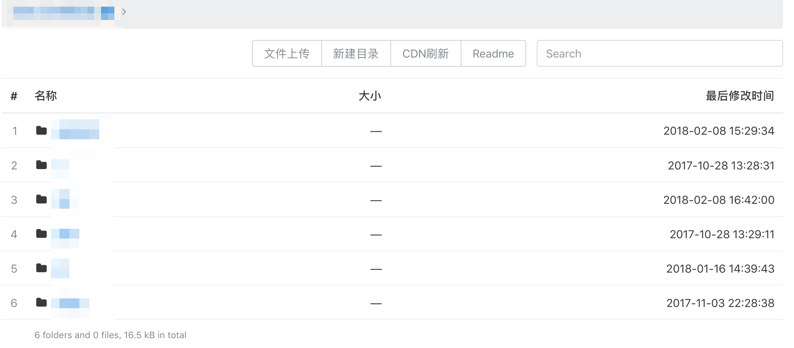
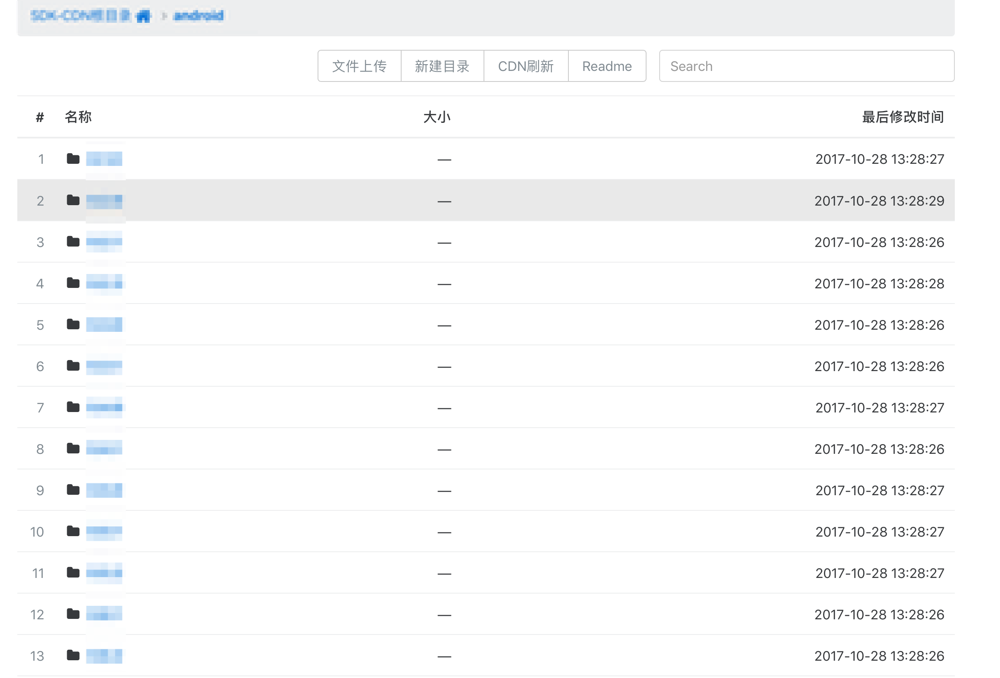
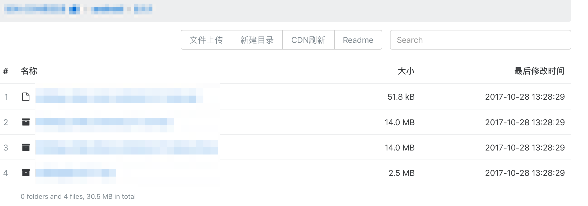

## file-upload  ## 

file-upload用于部分CDN文件上传和CDN刷新使用。  
项目fork自Wildog/flask-file-server。  
但我对项目结构做了较大的调整，调整后是比较大众的Flask项目结构。  
新增新建目录功能，还改了一些细节的功能项。  


## 运行环境 ## 

Python3.5  

## 模块依赖 ##  
```
pip3 install flask
pip3 install flask-views
pip3 install humanize
pip3 install requests
pip3 install gunicorn  
```

## 部署说明 ##    
较为正式的环境建议使用 Python + Flask + Nginx + Virtualenv + Gunicorn 方式  

## 项目展示 ##



